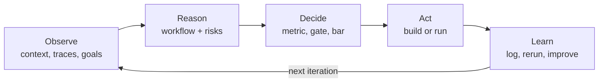

# AI Product Engineering Lab

AI Product Lab is an AI product engineering proof-of-work lab. It turns AI product and product-management work into systems that can be built, evaluated, reviewed, monitored, and improved over time.

The point is not to show that AI can draft impressive artifacts once. The point is to show the engineering discipline behind trustworthy AI product work: measurable workflows, explicit gates, failure logs, reruns, and a visible learning loop.

This repo is not primarily an onboarding product or a generic productivity template. It is a public lab for demonstrating AI product judgment, eval design, agentic workflow architecture, and production-minded operating discipline.

---

## What this proves

A skeptical reviewer should be able to inspect this repo and see evidence of:

- **AI product engineering judgment** — product work framed as systems, metrics, gates, and tradeoffs.
- **Agentic workflow architecture** — bounded agents, clear routing, quality gates, and human-in-the-loop pauses.
- **Eval design** — offline suites, planted-flaw meta-evals, author/grader separation, and freshness tracking.
- **Grounding and hallucination control** — answer keys, source-of-truth files, review rubrics, and failure taxonomies.
- **Failure discipline** — negative results are logged, remediated, and rerun instead of hidden.
- **Portfolio-grade signal** — RegEval is the flagship measurable artifact; the surrounding lab shows how it is built and governed.

## What this is, in one minute

Most AI demos look amazing for five minutes and then fall apart the moment you trust them with something real. The interesting part is not the demo. It is everything after: *Is it right? How often is it wrong? Can it be proven? And what happens when it fails?*

This lab is where those questions get answered on real projects. Three things happen here, over and over:

- **Build** — make a small AI tool, workflow, or product artifact.
- **Measure** — check whether it actually works, with numbers rather than gut feel. These checks are called *evals*, short for evaluations.
- **Log** — write down what was learned, failures included, so the knowledge compounds over time.

Build, measure, learn, repeat — and never quietly delete the parts that did not work.

## How it works

Everything runs on one product-engineering loop:

A few rules turn this from a to-do list into something you can trust:

- **The numbers decide** — a project only counts as working when the measurements say so, not when someone declares it good enough.
- **Nothing gets erased** — every result, especially the failures, is written down and kept.
- **Authoring and grading are separated** — eval runners and graders use different contexts so the system is not grading itself.
- **Anything public is gated** — before a public artifact ships, automatic reviewers check for overclaiming, weak evidence, and reader confusion.

### Under the hood

The lab is built in three layers that stack on top of each other:

| Layer | What it does | Where it lives |
|---|---|---|
| **1. Strategy** | Decides what to work on and why | `Agents/` |
| **2. Execution** | The actual building and testing | `Projects/`, `Evals/` |
| **3. Enforcement** | The quality checks that run automatically | `Workflows/`, `Tools/`, `.github/` |

The enforcement layer is the important part. The checks are not just promises in a doc; they are wired into local hooks, CI, artifact sidecars, pending-rerun ledgers, and review workflows.

The full architecture, folder by folder, is in **[`HOW-IT-WORKS.md`](HOW-IT-WORKS.md)**.

## Latest public proof signals

| Signal | Latest public status | Evidence | Known gap |
|---|---|---|---|
| CI quality gates | Passing on `main` as of 2026-07-06 | [`quality-gates.yml`](.github/workflows/quality-gates.yml) + [latest run](https://github.com/richardan01/AI-Product-Lab/actions/runs/28797849060) | Branch protection must be applied in GitHub settings to enforce the documented required checks. |
| Onboarding workflow eval | Content pass on 2026-06-23; temporal evals 02/07 pass on 2026-07-05 | [`Evals/run-log.md`](Evals/run-log.md) | Full transcripts/results are local and gitignored; public repo carries the summary, not the raw evidence. |
| Gate-group eval | First full run closed on 2026-07-06: r1 6/8 fail, remediation, r2 7/8 pass | [`Evals/run-log.md`](Evals/run-log.md), [`Evals/failure-log.md`](Evals/failure-log.md) | Ducard still has a non-blocking C7 schema residual: prose before JSON. |
| RegEval flagship | Measurable judge-alignment loop with logged κ history and contamination correction | [`Evals/regeval/regeval-suite.md`](Evals/regeval/regeval-suite.md), [`Evals/run-log.md`](Evals/run-log.md) | Public reviewer should read the caveats before treating any single score as final validation. |

## Why the Batman theme?

Fair question. Look around and you will notice the assistants that help run the lab are named after Batman characters. It is a memory trick, not a gimmick: each one is a focused helper with a single clear job, and the names make it easy to remember who does what.

| Assistant | What they handle |
|---|---|
| **Bruce Wayne** | The big-picture strategy and direction |
| **Alfred** | Day-to-day planning and prep |
| **Lucius Fox** | Building and prototyping |
| **Oracle** | Research and digging things up |
| **Nightwing** | Writing — posts, essays, talks |
| **The Riddler** | Poking holes in things before they go public |
| **Henri Ducard** | Sharpening the technical depth |
| **Vicki Vale** | Reading drafts the way a real reader would |

The last two — the Riddler and Vicki Vale — are the mandatory public-artifact reviewers.

## The main project: RegEval

If there is only time for one thing, make it this.

RegEval asks a simple but important question: **can you trust an AI to check whether something follows the rules?** Picture a compliance officer at a bank, reading documents to spot anything that breaks regulations: slow, expensive, and easy to get wrong. Could an AI handle the first pass?

Hoping the AI is right is not good enough, so RegEval measures it. The AI makes its calls, those calls are compared against human labels, and the result is scored as agreement between the AI and the human standard.

There is an honesty story baked in, too. Early on, the project hit a classic eval trap: the AI was graded on examples it had effectively already seen, which made the score look stronger than it was. That slip-up is written up and kept in the repo on purpose. Catching mistakes like that is part of the proof.

*Technical version: an LLM-as-judge framework for regulated-domain compliance classification, scored with Cohen's κ. Methodology and results are in [`Evals/regeval/regeval-suite.md`](Evals/regeval/regeval-suite.md).*

## Want to look around?

Pick a starting point based on what you want to inspect:

- **"Show me the architecture."** → [`HOW-IT-WORKS.md`](HOW-IT-WORKS.md)
- **"Show me the proof."** → [`PROOF-OF-WORK.md`](PROOF-OF-WORK.md)
- **"Show me the run history."** → [`Evals/run-log.md`](Evals/run-log.md)
- **"Show me the main project."** → [`Projects/ralph/brief.md`](Projects/ralph/brief.md)

And here is what lives in each main folder:

| Folder | What's inside |
|---|---|
| `Agents/` | The Batman-themed assistants and the overall strategy |
| `Projects/` | The flagship build loop for RegEval |
| `Evals/` | Tests, scores, run logs, failure logs, and eval protocols |
| `Workflows/` | Step-by-step operating recipes, including publishing checks |
| `Tools/` | Scripts that enforce local quality gates |
| `.github/` | CI replay of the quality gates |
| `Knowledge/` | Notes and research collected along the way |
| `Templates/` | Reusable document skeletons |
