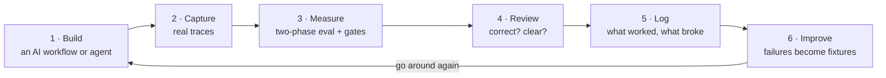

# AI Product Lab


**A grounded way to evaluate agentic products — point it at a real Claude Code, Codex, or
chatbot session and get a graded read on whether the *agent* did the right thing, not just
whether its final answer looked good.**

---

## The problem

Product managers are shipping agentic products — chatbots, copilots, coding harnesses,
multi-step agents — with no practical way to tell if they actually work. The demo looks
great for five minutes; then the agent picks the wrong tool, hallucinates an argument, drops
a constraint the user gave three turns ago, or quietly drifts off the task. **A check that
only reads the final answer can't see any of that** — agents graded on final output alone
pass far more cases than a look at the full trajectory reveals.

The engineering tools that measure this (LangSmith, Braintrust) assume you're an engineer
instrumenting your own SDK. The academic agent benchmarks don't touch your product. So most
PM teams fall back on vibes.

AI Product Lab is the answer to *"okay, but how do I actually evaluate my agent?"* — a
method a PM can run, grounded in the field's most-cited applied-eval work.

## What it does

Two things, one loop:

1. **Grades agent trajectories.** The [`agent-harness`](Evals/agent-harness/) suite takes a
   real session and scores it in two phases — **(1)** did it accomplish the task (black
   box), and **(2)** six step-level axes: tool choice, parameter extraction, error recovery,
   context retention, efficiency, and goal alignment. Every criterion is binary; every
   failure is tagged `bad` (blocks) or `sad` (recoverable).
2. **Runs the full eval lifecycle around it** — error analysis on real traces, calibrated
   LLM-as-judge, offline suites, meta-evals that grade the graders, and weekly monitoring —
   so a workflow moves from "seems fine" to "measured."

## The 15-minute quickstart

Attach to a session you already have and grade it:

```bash
# 1. Normalize a real agent session into a trace
#    Claude Code sessions live at ~/.claude/projects/<proj>/<session>.jsonl
python3 scripts/trace_adapter.py claude-code --latest --suite agent-harness
#    Codex: python3 scripts/trace_adapter.py codex --input ~/.codex/sessions/YYYY/MM/DD/rollout-*.jsonl --suite agent-harness

# 2. See what got captured (turns, tool_calls, retrievals, metrics)
#    Evals/_schema/trace-schema.md

# 3. Grade it — one eval-grader per criterion, author/grader separation enforced
#    Follow Evals/agent-harness/protocol.md (Mode A)
```

A fully worked run (seven verdicts + aggregate) is in
[`Evals/agent-harness/_public-evidence/`](Evals/agent-harness/_public-evidence/).

## What it's grounded in

The methodology is a faithful implementation of **Shreya Shankar & Hamel Husain**,
*Evals for AI Engineers* (O'Reilly, 2026) and their widely-read
[evals FAQ](https://hamel.dev/blog/posts/evals-faq/) — error-analysis-first, binary metrics,
application-specific (not generic) failure modes, calibrated judges (TPR/TNR ≥ 0.9), and the
two-phase agentic-evaluation split. The meta-eval layer ("who grades the graders?") is
grounded in Shankar et al., [*Who Validates the Validators?*](https://arxiv.org/abs/2404.12272)
(UIST 2024).

## What's different here

This is **not** another trajectory-tracing tool — LangSmith and Braintrust already do that,
and better, for engineers. The bet is different:

- **Methodology-first, not dashboard-first.** The value is the discipline (error analysis →
  calibrated judge → meta-eval → monitoring), not a UI.
- **Meta-evals that grade the graders.** The lab's own quality gates are themselves eval'd
  with planted-flaw fixtures and answer keys. A gate that misses a known blocker, or flunks
  clean work, fails its own suite.
- **Attach to the harness you already use.** No SDK instrumentation — read the JSONL Claude
  Code and Codex already write to disk.
- **Local and Markdown-native.** The whole operating surface is files in a repo. Nothing to
  host, nothing to send anywhere.

Full architecture and the loop diagram: **[`AGENTIC-EVAL-FRAMEWORK.md`](AGENTIC-EVAL-FRAMEWORK.md)**.

## The loop



Three rules turn this from a to-do list into something trustworthy:

- **The numbers decide** — a workflow counts as "working" only when the measurements say so.
- **Nothing gets erased** — every result, especially failures, is kept, so you can watch the
  work actually improve.
- **Anything published is checked first** — two automated reviewers (adversarial + reader-voice)
  must both approve before a public artifact ships.

## The flagship: RegEval

**Can you trust an AI to check whether something follows the rules?** RegEval is an
LLM-as-judge framework for regulated-domain compliance classification, scored with Cohen's κ
(agreement between the AI and a human expert). It also carries an honesty story on purpose:
early on it hit the classic contamination trap — graded on examples it had effectively
already seen — and that incident is written up and kept in the repo as a permanent reminder.
Methodology and results: [`Evals/regeval/regeval-suite.md`](Evals/regeval/regeval-suite.md).

## How the repo is organized

Three layers (full tour in [`HOW-IT-WORKS.md`](HOW-IT-WORKS.md)):

| Layer | What it does | Where |
|---|---|---|
| **Strategy** | Decides what to work on and why | `Agents/` |
| **Execution** | The building and the measuring | `Projects/`, `Evals/` |
| **Enforcement** | Quality checks wired in as Git hooks, not habits | `Workflows/`, `Tools/` |

> **Why the Batman names?** The helper agents that run the lab are named after Batman
> characters (Bruce Wayne = strategy, Lucius Fox = building, Oracle = research, the Riddler
> and Vicki Vale = the two pre-publish reviewers, …). It's a memory trick — each is a focused
> helper with one job — not a gimmick. See [`HOW-IT-WORKS.md`](HOW-IT-WORKS.md).

## Where to start

| Curious about | Go to |
|---|---|
| The framework and the loop | [`AGENTIC-EVAL-FRAMEWORK.md`](AGENTIC-EVAL-FRAMEWORK.md) |
| Grading an agent session | [`Evals/agent-harness/`](Evals/agent-harness/) |
| What it's actually produced | [`Evals/run-log.md`](Evals/run-log.md) — the dated logbook |
| The flagship build | [`Projects/ralph/brief.md`](Projects/ralph/brief.md) |

## Honest status

This is a faithful implementation of Shankar & Husain's eval lifecycle, **extended for
agentic harnesses** — not a finished product and not "the most grounded evals tool." Harness
support today: **claude-code** (verified against a real session), **codex** (documented
format, validate on first real rollout), **cowork** (planned). The claim the repo will earn,
not assert, is measured in public evidence — which is why the worked runs live in the repo.
