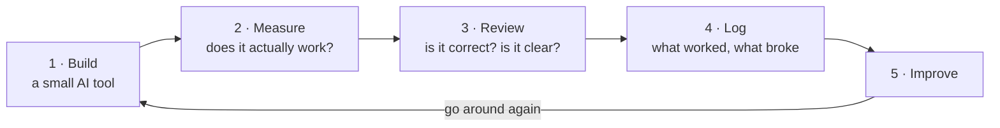

# AI Product Lab

AI Product Lab is a personal workshop for building small AI projects and finding out whether they actually work — not just whether they look impressive at first glance.

The real work starts after that first impression: measuring how often it gets things right, catching where it fails, and keeping an honest record of what broke and how it got fixed.

New to this kind of repo? No problem. This page explains what it is and how it fits together, in plain language — no code required.

---

## What this is, in one minute

Most AI demos look amazing for five minutes and then fall apart the moment you trust them with something real. The interesting part isn't the demo. It's everything after: *Is it right? How often is it wrong? Can it be proven? And what happens when it fails?*

This lab is where those questions get answered on real projects. Three things happen here, over and over:

- **Build** — make a small AI tool or workflow.
- **Measure** — check whether it actually works, with numbers rather than gut feel. (These checks are called *evals*, short for evaluations.)
- **Log** — write down what was learned, failures included, so the knowledge adds up over time.

Build, measure, learn, repeat — and never quietly delete the parts that didn't work.

## How it works

Everything runs on one simple loop. A project goes around it again and again, becoming a little more trustworthy each lap:

A few rules turn this from a to-do list into something you can trust:

- **The numbers decide** — a project only counts as "working" when the measurements say so, not when someone declares it good enough.
- **Nothing gets erased** — every result, especially the failures, is written down and kept. You can scroll back and watch the work actually improve, instead of seeing only a polished ending.
- **Anything published is checked first** — before a write-up goes public, two automatic reviewers read it. One hunts for anything wrong or overstated; the other reads it like a stranger would and flags where it gets confusing. Both have to approve it.

### Under the hood

If you like structure, the lab is built in three layers that stack on top of each other:

| Layer | What it does | Where it lives |
|---|---|---|
| **1. Strategy** | Decides what to work on and why | `Agents/` |
| **2. Execution** | The actual building and testing | `Projects/`, `Evals/` |
| **3. Enforcement** | The quality checks that run automatically | `Workflows/`, `Tools/` |

The enforcement layer is the interesting one. The quality checks aren't a promise someone makes and then forgets — they're wired in so they *have* to run before anything ships. (For the technically curious: it's a Git hook that physically blocks publishing until both reviews pass.)

The full architecture, folder by folder, is in **[`HOW-IT-WORKS.md`](HOW-IT-WORKS.md)**.

## Why the Batman theme?

Fair question. Look around and you'll notice the "assistants" that help run the lab are all named after Batman characters. It's a memory trick, not a gimmick: each one is a focused helper with a single clear job, and the names make it easy to remember who does what.

| Assistant | What they handle |
|---|---|
| **Bruce Wayne** | The big-picture strategy and direction |
| **Alfred** | Day-to-day planning and prep |
| **Lucius Fox** | Building and prototyping |
| **Oracle** | Research and digging things up |
| **Nightwing** | Writing — posts, essays, talks |
| **The Riddler** | Poking holes in things before they go public |
| **Henri Ducard** | Sharpening the technical depth |
| **Vicki Vale** | Reading drafts the way a real reader would |

The last two — the Riddler and Vicki Vale — are the "two automatic reviewers" from the loop above.

## The main project: RegEval

If there's only time for one thing, make it this.

RegEval asks a simple but important question: **can you trust an AI to check whether something follows the rules?** Picture a compliance officer at a bank, reading documents to spot anything that breaks regulations — slow, expensive, easy to get wrong. Could an AI handle the first pass?

Hoping the AI is right isn't good enough, so RegEval measures it. The AI makes its calls, those calls are compared against a human expert's answers, and it all boils down to one score: how often the two agree. If they almost always agree, the AI might be trustworthy. If they don't, that's worth knowing — before anyone gets hurt.

There's an honesty story baked in, too. Early on, the project hit a classic trap: the AI got graded on examples it had effectively already seen, which makes any score look better than it really is. That slip-up is written up and kept in the repo on purpose, as a permanent reminder. Catching mistakes like that is the whole point.

*Technical version: an LLM-as-judge framework for regulated-domain compliance classification, scored with Cohen's κ (agreement between the AI and human labels). Methodology and results are in [`Evals/regeval/regeval-suite.md`](Evals/regeval/regeval-suite.md).*

## Want to look around?

No need to read any code. Pick a starting point based on what you're curious about:

- **"Show me the big picture."** → [`HOW-IT-WORKS.md`](HOW-IT-WORKS.md)
- **"What has this actually produced?"** → [`Evals/run-log.md`](Evals/run-log.md), the dated logbook of every test run
- **"Tell me about the main project."** → [`Projects/ralph/brief.md`](Projects/ralph/brief.md)

And here's what lives in each main folder:

| Folder | What's inside |
|---|---|
| `Agents/` | The Batman-themed assistants and the overall strategy |
| `Projects/` | The flagship build (RegEval, run by a loop called "Ralph") |
| `Evals/` | All the tests, the scores, and the logbook |
| `Workflows/` | Step-by-step recipes, including the publishing checks |
| `Tools/` | The script that enforces those checks |
| `Knowledge/` | Notes and research collected along the way |
| `Templates/` | Reusable document skeletons |
